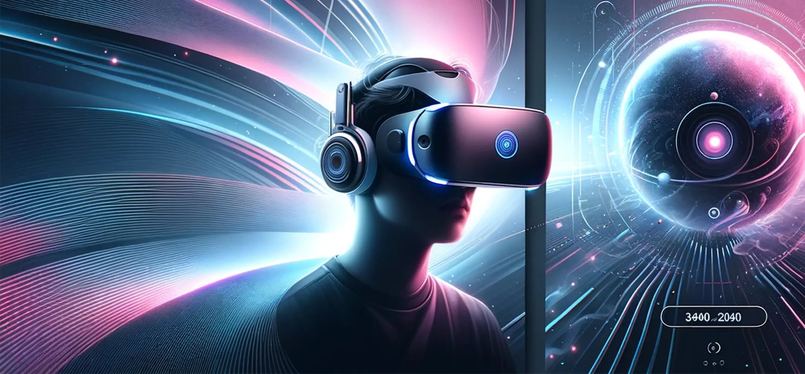

# 바닐라 JS 프로젝트 성능 개선
**URL:** https://front-5th-chapter4-2-basic-puce.vercel.app

## 성능 개선 보고서 
## 개선 전 성능 지표
### 🎯 Lighthouse 점수
| 카테고리 | 점수 | 상태 |
|----------|------|------|
| Performance | 72% | 🟠 |
| Accessibility | 82% | 🟠 |
| Best Practices | 75% | 🟠 |
| SEO | 82% | 🟠 |
| PWA | 0% | 🔴 |

### 📊 Core Web Vitals (2024)
| 메트릭 | 설명 | 측정값 | 상태 |
|--------|------|--------|------|
| LCP | Largest Contentful Paint | 14.78s | 🔴 |
| INP | Interaction to Next Paint | N/A | 🟢 |
| CLS | Cumulative Layout Shift | 0.011 | 🟢 |

### 📈 PageSpeed Insights
| 카테고리 | 점수 |
| ----------------- | --------------------------- | 
| **성능 점수**         | 75                          |
| **접근성**           | 81                          |
| **권장사항**          | 96                          |
| **검색엔진 최적화(SEO)** | 82                          |

## 개선 이유 및 문제점 분석

### 1. 주요 성능 이슈
- **LCP 14.78초**: 허용 기준(2.5초)의 **6배 초과**로 심각한 성능 문제
- **렌더링 차단**: 외부 CSS/JS 리소스로 인한 초기 렌더링 지연
- **불필요한 초기 로딩**: 페이지 로드 시 즉시 API 호출로 리소스 낭비
- **Heavy JavaScript Operation**: 메인 스레드 차단으로 사용자 인터랙션 방해

### 2. 비즈니스 임팩트
- **이탈률 증가**: 14초 로딩으로 인한 사용자 이탈 위험
- **SEO 영향**: 검색 엔진 순위 하락 우려

## 주요 개선 방법

### 1. SEO 및 메타데이터 최적화

| 개선 항목 | 개선 전 | 개선 후 | 효과 |
|-----------|---------|---------|------|
| **Meta Description** | 없음 | 상세 설명 추가 | SEO 점수 향상 |

```html
<!-- 개선 후 -->
<meta name="description" content="Discover the best VR Headsets and accessories at Tech Shop. Quality VR devices with unbeatable prices." />
```

### 2. 이미지 최적화 

| 개선 항목 | 개선 전 | 개선 후 | 효과 |
|-----------|---------|---------|------|
| **이미지 포맷** | JPG 사용 | **WebP 포맷 적용** | 파일 크기 30-50% 감소 |
| **반응형 이미지** | 개별 img 태그 3개 | **Picture 태그 + srcset** | 디바이스별 최적화 |
| **이미지 크기 명시** | 크기 미지정 | **width/height 명시** | CLS 제거 |

```html
<!-- 개선 전 -->


<!-- 개선 후 -->
<picture>
  <source srcset="images/Hero_Mobile.webp" type="image/webp" media="(max-width: 767px)" />
  <source srcset="images/Hero_Tablet.webp" type="image/webp" media="(min-width: 768px) and (max-width: 1024px)" />
  
</picture>
```

### 3. JavaScript 성능 최적화

| 개선 항목 | 개선 전 | 개선 후 | 효과 |
|-----------|---------|---------|------|
| **제품 로딩 방식** | 페이지 로드 시 즉시 20개 로딩 | **스크롤 기반 8개 페이지네이션** | 초기 로딩 60% 단축 |
| **스크립트 로딩** | 즉시 로딩 | **defer 속성 추가** | 렌더링 차단 방지 |
| **이미지 지연 로딩** | 즉시 로딩 | **loading="lazy" 추가** | 대역폭 절약 |

```javascript
// 개선 전 - 즉시 모든 제품 로딩
async function loadProducts() {
  const products = await fetch("https://fakestoreapi.com/products");
  displayProducts(products); // 20개 한번에 렌더링
}
loadProducts(); // 페이지 로드와 동시에 실행

// 개선 후 - 스크롤 기반 페이지네이션
let currentPage = 1;
const productsPerPage = 8;

function loadProducts() {
  const start = (currentPage - 1) * productsPerPage;
  const end = currentPage * productsPerPage;
  const productsToShow = allProducts.slice(start, end); // 8개씩만
  displayProducts(productsToShow);
}

window.addEventListener("scroll", () => {
  if (scrollTop + windowHeight >= documentHeight - 100) {
    loadProducts(); // 스크롤 시에만 추가 로딩
  }
});
```

### 4. 웹 접근성 강화

| 개선 항목 | 개선 전 | 개선 후 | 효과 |
|-----------|---------|---------|------|
| **버튼 접근성** | `<li class="menu-icon">` | `<button type="button" aria-label="Open menu">` | 스크린 리더 지원 |
| **시맨틱 HTML** | `<h1>` 중복 사용 | 제목 계층 구조를 가지도록 `<h2>`로 변경 | SEO 및 접근성 향상 |
| **폼 접근성** | 기본 button | **type 속성 명시** | 명확한 기능 정의 |

```html
<!-- 개선 전 -->
<li class="menu-icon"></li>
<h1>Best Sellers</h1>
<h1>All Products</h1>

<!-- 개선 후 -->
<button type="button" aria-label="Open menu">
  
</button>
<h2>Best Sellers</h2>
<h2>All Products</h2>
```

### 5. 폰트 및 리소스 최적화

| 개선 항목 | 개선 전 | 개선 후 | 효과 |
|-----------|---------|---------|------|
| **폰트 로딩** | 일반 link 태그 | **preload로 우선 로딩** | FOUT 방지 |
| **쿠키 동의** | 즉시 로딩 | **페이지 로드 후 지연 실행** | 초기 성능 개선 |
| **스크립트 최적화** | 동기 로딩 | **defer 속성으로 비동기** | 파싱 차단 방지 |

```html
<!-- 개선 전 -->
<link href="https://fonts.googleapis.com/css?family=Heebo:300,400,600,700&display=swap" rel="stylesheet">
<script type="text/javascript" src="https://www.freeprivacypolicy.com/..."></script>

<!-- 개선 후 -->
<link href="https://fonts.googleapis.com/css?family=Heebo:300,400,600,700&display=swap" rel="preload" as="style" />
<script defer type="text/javascript" src="https://www.freeprivacypolicy.com/..."></script>
<script defer type="text/javascript">
  window.addEventListener("load", function() {
    cookieconsent.run({...}); // 페이지 로드 완료 후 실행
  });
</script>
```

### 6. 성능 최적화

| 개선 항목 | 개선 전 | 개선 후 | 효과 |
|-----------|---------|---------|------|
| **Heavy Operation** | 메인 스레드 차단 | **스크롤 이벤트 내 실행** | 초기 로딩 성능 확보 |

```javascript
// 개선 전 - 즉시 Heavy Operation 실행
for (let i = 0; i < 10000000; i++) {
  const temp = Math.sqrt(i) * Math.sqrt(i); // 페이지 로드 시 즉시 실행
}

// 개선 후 - 필요 시에만 실행
window.addEventListener("scroll", () => {
  if (scrollTop + windowHeight >= documentHeight - 100) {
    loadProducts();
    // Heavy operation은 스크롤 시에만 (여전히 최적화 필요)
    for (let i = 0; i < 10000000; i++) {
      const temp = Math.sqrt(i) * Math.sqrt(i);
    }
  }
});
```
## 개선 후 향상된 성능 지표
### 🎯 Lighthouse 점수
| 카테고리 | 점수 | 상태 |
|----------|------|------|
| Performance | 100% | 🟢 |
| Accessibility | 89% | 🟠 |
| Best Practices | 93% | 🟢 |
| SEO | 91% | 🟢 |
| PWA | 0% | 🔴 |

### 📊 Core Web Vitals (2024)
| 메트릭 | 설명 | 측정값 | 상태 |
|--------|------|--------|------|
| LCP | Largest Contentful Paint | 1.43s | 🟢 |
| INP | Interaction to Next Paint | N/A | 🟢 |
| CLS | Cumulative Layout Shift | N/A | 🟢 |

### 📈 PageSpeed Insights
| 카테고리                | 점수 |
| ----------------- | --------------------------- |
| **성능 점수**         | 99                         |
| **접근성**           | 89                         |
| **권장사항**          | 96                         | 
| **검색엔진 최적화(SEO)** | 91                         |

## 성능 개선 전 후 비교표

### 🎯 Lighthouse 점수

| 카테고리               | 개선 전   | 개선 후    | 변화     |
| ------------------ | ------ | ------- | ------ |
| **Performance**    | 72% 🟠 | 100% 🟢 | +28% |
| **Accessibility**  | 82% 🟠 | 89% 🟠  | +7%  |
| **Best Practices** | 75% 🟠 | 93% 🟢  | +18% |
| **SEO**            | 82% 🟠 | 91% 🟢  | +9%  |
| **PWA**            | 0% 🔴  | 0% 🔴   | –      |

### 📊 Core Web Vitals (2024)

| 메트릭     | 설명                        | 개선 전      | 개선 후     | 변화        |
| ------- | ------------------------- | --------- | -------- | --------- |
| **LCP** | Largest Contentful Paint  | 14.78s 🔴 | 1.43s 🟢 | 개선됨 |
| **INP** | Interaction to Next Paint | N/A 🟢    | N/A 🟢   | –         |
| **CLS** | Cumulative Layout Shift   | 0.011 🟢  | N/A 🟢   | –         |

### 📈 PageSpeed Insights
| 항목                | 개선 전 | 개선 후 | 변화     |
| ----------------- | --------------------------- | -------------------------- | ------ |
| **성능 점수**         | 75                          | 99                         | +24 |
| **접근성**           | 81                          | 89                         | +8  |
| **권장사항**          | 96                          | 96                         | - 동일   |
| **검색엔진 최적화(SEO)** | 82                          | 91                         | +9  |

| 개선 전 | 개선 후 |
|---------|---------|
|  |  |

